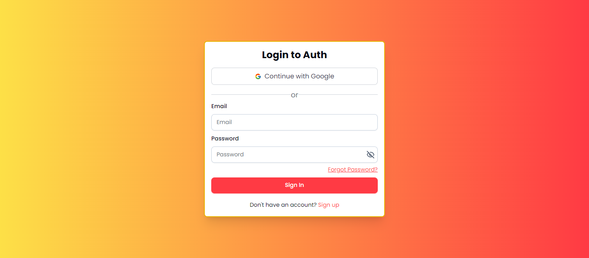

# Custom Next.js 14 Authentication - No Third-Party Libraries - With Google Login

This is a simple authentication project built with Next.js 14 and Prisma. It includes features like:

- **Sign up**
- **Sign in**
- **Forgot password**
- **Reset password**
- **Email verification**
- **Google authentication with react-google auth**
- **Dashboard with basic user information**
- **Session & Cookies with jose**
- **Form Validation with zod and React Hook Form**

## Built With

- **Next.js 14**
- **Typescript**
- **Prisma ORM**
- **Postgresql**
- **Tailwind CSS**
- **Shadcn UI**

## Getting Started

1. Clone the repository.
2. Install dependencies with `npm install`.
3. Create a `.env` file by copying the contents of `.env.example`.
4. Start the development server with `npm run dev`.
5. Access the application at [http://localhost:3000](http://localhost:3000).

## Development

This project uses [Next.js](https://nextjs.org/) and [Prisma](https://www.prisma.io/) for the backend. [Tailwind CSS](https://tailwindcss.com/) is used for styling.

## Deployment

The application can be deployed to any hosting provider that supports Next.js. For a simple setup, consider using [Vercel](https://vercel.com/).
